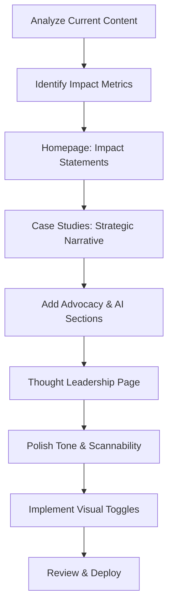

# Portfolio Redo Plan: From Feature Depth to Strategic Impact

## Executive Summary
Your current portfolio has excellent detailed content (e.g., the 255-line setup-your-business.md) that accurately captures your work. The plan preserves ALL of this depth in collapsible "Technical Deep Dives" sections. The change is in the narrative structure: lead with strategic value and qualitative wins, then allow readers to dive into the specifics. This keeps your authentic voice and details while making the portfolio scannable and competitive.

## Key Projects and Strategic Advantages
- **Simple Formations (Primary Project)**: Led product vision for a bespoke guided incorporation flow tailored to Kenyan Company Secretary and Governance needs, used by thousands of founders despite operational constraints.
  - Qualitative Wins: Transformed fragmented legal processes into a cohesive, user-guided experience; demonstrated ability to deliver complex, compliant systems in a regulated environment.
  - Strategic Pillars: Streamlining Compliance (demystified legal jargon for non-experts), Scaling for Enterprise (adapted to bespoke requirements while maintaining scalability), Automating Onboarding (reduced stakeholder coordination from weeks to days).
  - Advocacy: Navigated Product Owner constraints by championing user-centric compliance; balanced bespoke needs with efficient, scalable architecture.
  - Process as Advantage: Led the build of a robust, maintainable system in a high-stakes domain; showcased strategic leadership in turning ambiguity into clarity and outcomes.
  - AI Integration: Leveraged AI for prototyping and synthesis to accelerate development in a constrained timeline.
- **WabiSabi Technologies**: Founder role; emphasize entrepreneurial leadership and product experimentation.
- **Other**: Fintech/SaaS background; highlight hybrid IC-Leader role in turning complexity into clarity.

## Detailed Implementation Plan

### 1. Homepage Restructure (Advantage-First)
- **Objective**: Hook recruiters with strategic advantages in a bespoke, constrained domain.
- **Changes**:
  - Rewrite project cards: "Scaling incorporations" → "Transforming fragmented legal processes into cohesive, compliant experiences for Kenyan startups."
  - Add qualitative impact grid: Process improvements (e.g., "Reduced stakeholder coordination from weeks to days"), strategic wins (e.g., "Delivered maintainable system despite overengineering risks").
  - Update intro: Emphasize leadership in ambiguity ("I navigate complex, regulated environments to deliver user-centric solutions that balance compliance with speed").
- **Files**: `portfolio_live/priv/content/pages/home.md`
- **Tools**: Adapt prompt #1 to focus on qualitative advantages and advocacy.

### 2. Case Studies Overhaul (Hub-and-Spoke Model)
- **Objective**: Present process and build as strategic advantages, with depth in toggles.
- **Structure**:
  - Executive Summary: Qualitative impact grid (e.g., "Demystified legal processes for non-experts") + 4-year evolution summary highlighting leadership in constraints.
  - Strategic Narrative: 3 pillars with insight-led headers (e.g., "Streamlining Compliance: Turning legal jargon into guided workflows").
  - Technical Deep Dives: Collapsible sections for feature breakdowns, framed as "Architectural Achievements" highlighting strategic design decisions.
  - Advocacy Section: Specific examples of navigating PO constraints (e.g., "Championed user-centric compliance within operational boundaries, ensuring efficient and scalable outcomes").
  - AI Workflow: Callouts on using AI to accelerate in constrained timelines.
- **Files**: `portfolio_live/priv/content/case_studies/simple-formations.md` + detailed MDs in `case-studies/` (ALL existing content preserved in deep dives).
- **Tools**: Adapt prompt #2 to focus on qualitative wins and process advantages; the detailed breakdowns stay intact, just reorganized.

### 3. Scannability Optimization
- **Objective**: Headers tell the story alone.
- **Changes**: Replace "Research" with "Testing revealed users found CTA confusing"; tie to qualitative advantages (e.g., "Advocacy led to user-centric compliance over feature bloat").
- **Files**: All case study MDs.
- **Tools**: Adapt prompt #3 to focus on process wins and advocacy.

### 4. Thought Leadership Section
- **Objective**: Show personality and point of view.
- **Content**: Core belief, how I work (AI-leverage), curated stack (5 tools/books), philosophy example.
- **Files**: New `portfolio_live/priv/content/pages/library.md`; update navigation.
- **Tools**: Prompt #4.

### 5. Advocacy and AI Integration
- **Objective**: Demonstrate senior-level navigation of constraints.
- **Changes**: Add sections on stakeholder advocacy and AI acceleration.
- **Files**: Case studies.
- **Tools**: Prompt #5 for audit.

### 6. Visual Hierarchy for Depth
- **Objective**: Keep depth without clutter.
- **Implementation**: Use HEEx in Phoenix for collapsible accordions (e.g., `

Deep Dive: Setup Workflow
...
`).
- **Files**: `portfolio_live/lib/portfolio_live_web/live/case_study_show_live.ex`
- **Tools**: Code mode for template updates.

## Workflow Diagram

## Risks and Mitigations
- **Losing Depth**: Mitigated by collapsible deep dives – ALL detailed content (e.g., your 255-line articles) is preserved and accessible.
- **Tone Too Salesy**: Use authoritative, minimal voice.
- **Perception of Constraints**: Frame as leadership opportunities – highlight strategic navigation of challenges to deliver value.
- **Lack of Quantifiable Metrics**: Focus on qualitative strategic advantages (e.g., "Delivered maintainable system in regulated environment despite delays").

## Next Steps
1. Approve this plan.
2. Start with Simple Formations case study using prompt #2.
3. Iterate on homepage.
4. Add thought leadership.

This plan transforms your portfolio to demonstrate strategic value while showcasing your 4-year expertise.